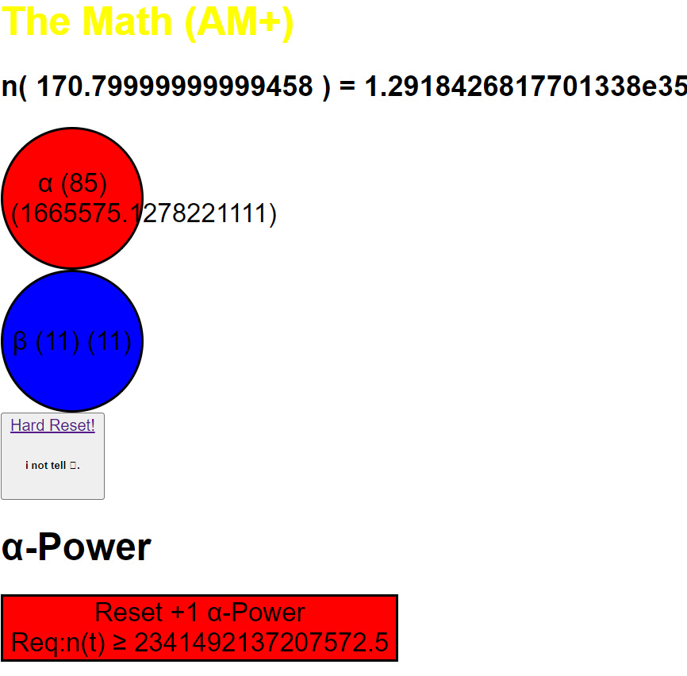

# INFO (AT MATH PLUS)

### I VERY GOOD base for vue, layer showns for v-if and specting for keep of things be a gold a be see thrown files vue-ifs get from files.
#### so weel spect base from vue when go addbition now.
[Changelog](changelog.md)
[TODO](TODO.md)
### WHEN KNOW THIS FILE SO WHEN FIRST THERE
$(\alpha + 1) \times \sqrt{20}$
#### COOL FILE WEEL GOOD!
- *SPACE NAMED WITH GOLD.*